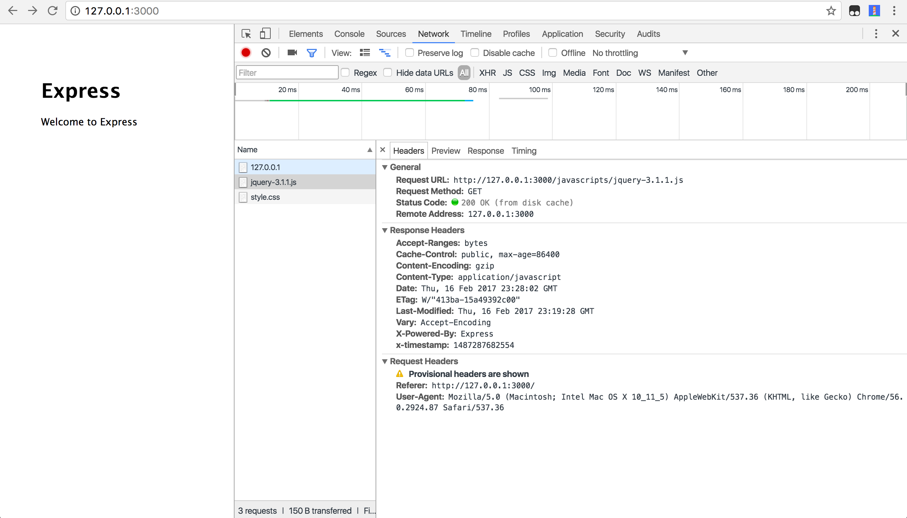
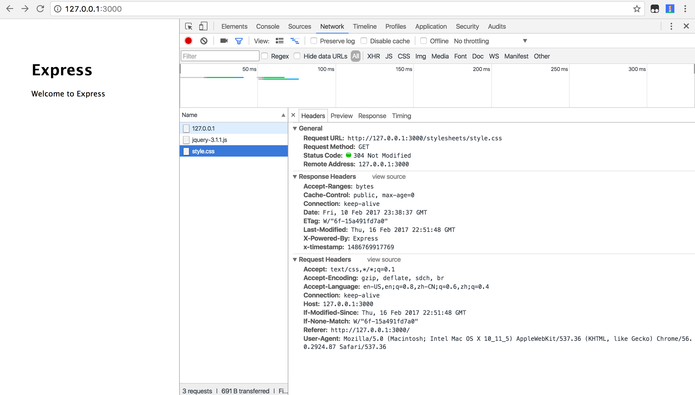
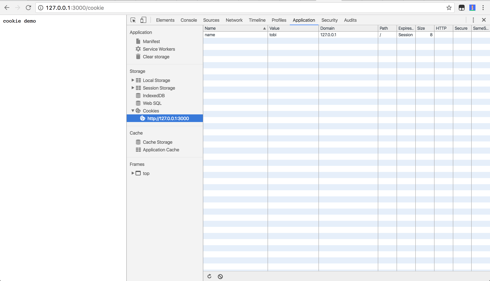

# web性能优化

- 01) 最简单的web server
	- node http
	- connect
	- express
- 02) http-request
	- postman
	- vscode debug
	- req里的属性
- 03) http-response
	- 增加Expires 或 Cache-Control头部 
	- 配置 ETags 
	- Gzip压缩 
	- Cookie
- 04）网络优化
	- 使用CDN 
	- 压缩HTTP请求 
	- 减少 DNS 查询
	- 压缩 JavaScript 和 CSS 
- 05) 其他
	- 对组件使用 Cookie-Free 域名 
	- 避免空的src 或 href 
	- 将样式放在上面 
	- 将脚本放到下面 
	- 避免 CSS 表达式，降低样式计算的范围和复杂度 
	- 评估样式计算的成本 
	- 将JavaScript 和 CSS 放到外面 
	- 避免重定向 
	- 移除重复脚本和样式 
	- 缓存 AJAX 请求 
	- 使用GET 处理 AJAX 请求 
	- 减少DOM元素数量 
	- 不要 404 
	- 避免 Filters 
	- 在HTML里不使用 Scale Images 
	- 保持favicon.ico 比较小并可缓存 

## 01)  最简单的web server

Write a http server use Nodejs

```
var http = require('http');

http.createServer(function(request,response){
    console.log(request);
    response.end('Hello world!');
}).listen(8888);
```

这就是最简单的实现

如果要是根据不同url去处理呢？

```
var http = require('http');

http.createServer(function(req, res){
    console.log(req);

    if(req.url =='/'){
      res.end('Hello world!');
    }else if(req.url =='/2'){
      res.end('Hello world!2');
    }else{
      res.end('Hello world! other');
    }
}).listen(8888);
```

如果成百上千、甚至更多http服务呢？这样写起来是不是太low了，肯定要封装一下，让它更简单。

connect就是这样的一个框架，下面我们看一下

### Write a http server  use Node connect

Connect is an extensible HTTP server framework for node using "plugins" known as middleware.

- extensible是可扩展的
- HTTP server framework是http服务端框架
- using "plugins" known as middleware即使用插件机制，就是大家常说的中间件

#### 先看一下helloworld

```
var connect = require('connect')
var http = require('http')

var app = connect()

// respond to all requests
app.use(function(req, res){
  res.end('Hello from Connect!\n');
})

//create node.js http server and listen on port
http.createServer(app).listen(3011)
```

http://127.0.0.1:3011/


回想一下上一节中的http的例子

```
http.createServer(function(request,response){
    ...
}).listen(8888);
```

与

```
var app = connect()

// respond to all requests
app.use(function(req, res, next){
  ...
})

//create node.js http server and listen on port
http.createServer(app).listen(3011)
```

说明

- 都是http.createServer
- 差异是createServer的参数独立出去了，并且在connect里通过app.use方法可以挂在多个插件式的中间件

编程上有区分可变和不可变状态，可变的抽取出去，不可变的就固化好即可。connect做的就是提供了可变部分的插件化。

#### 多url处理

好，我们再看一下它如何出个多个url情况

- /
- /2

connect2.js

```
var connect = require('connect')
var http = require('http')

var app = connect()

app.use('/2', function fooMiddleware(req, res, next) {
  // req.url starts with "/foo"
  res.end('Hello from Connect2!\n');
});

// respond to all requests
app.use(function(req, res){
  res.end('Hello from Connect!\n');
})

//create node.js http server and listen on port
http.createServer(app).listen(3011)
```

访问http://127.0.0.1:3011/2 看看能否访问？

上面讲了，connect实际上是将开发中得可变部分抽象出来，通过app.use方法都挂载到app对象上，这样处理起来就非常简单、清晰了。

#### 中间件顺序

下面我们看一下中间件顺序

connect2.js

```
var connect = require('connect')
var http = require('http')

var app = connect()

// respond to all requests
app.use(function(req, res){
  res.end('Hello from Connect!\n');
})

app.use('/2', function fooMiddleware(req, res, next) {
  // req.url starts with "/foo"
  res.end('Hello from Connect2!\n');
});

//create node.js http server and listen on port
http.createServer(app).listen(3011)
```

访问http://127.0.0.1:3011/2 看看能否访问？

答案是不能的，原因是第一个use里没有指定path，这时候它就响应了所有请求，根本不给第二use的机会，所以正确的写法是

```
app.use('/', function fooMiddleware(req, res, next) {
  // req.url starts with "/foo"
  res.end('Hello from Connect2!\n');
});

app.use('/2', function fooMiddleware(req, res, next) {
  // req.url starts with "/foo"
  res.end('Hello from Connect2!\n');
});

// respond to other requests
app.use(function(req, res){
  res.end('Hello from Connect!\n');
})
```

这其实和我们第一个http里写的if判断一样

```
if(req.url =='/'){
  res.end('Hello world!');
}else if(req.url =='/2'){
  res.end('Hello world!2');
}else{
  res.end('Hello world! other');
}
```

这样的写法是不是很讨厌？顺序都要思考，弄死人了，这其实就是很多人埋怨nodejs坑多的原因之一，是真的有问题，还是自己没有弄明白呢？

总结一下，我们能得出什么结论呢？

- use的中间件有顺序
- 中间件分类：全局和路由里的
- 中间件定义


### Express

#### helloworld

```
var express  = require('express');
var app      = express();

app.get('/', function (req, res) {
  res.send('Hello World')
})

// 随机端口3000 - 10000 之间
app.listen(4001)
```

#### 多url处理

```
var express  = require('express');
var app      = express();

app.get('/', function (req, res) {
  res.send('Hello World')
})

app.get('/2', function (req, res) {
  res.send('Hello World2')
})

// respond to other requests
app.use(function(req, res){
  res.end('Hello from Connect!\n');
})

// 随机端口3000 - 10000 之间
app.listen(4001)
```

### 总结一下

- connect的helloworld
- connect多url处理方式
- connect中间件顺序
- 最后讲了一下中间件

不只是Node.js可以构建web server，其他语言如php、java、ruby、python都可以的。大家要着重理解web server原理和请求响应模型。

## 02) 请求request

简称req

- POSTMAN
- VSCode Debug

内容

- 看看http请求如何发送
- 有哪些属性
- 在vscode里debug查看对应内容

## 03) 响应response

简称res

```
var http = require('http');

http.createServer(function(req, res){
  console.log(req);

  res.writeHead(200, {'content-type':'text/html'});
  res.write('<p>hi there!</p>');
  res.end()
}).listen(8888);
```

在express里 http://expressjs.com/en/4x/api.html#res.set

Sets the response’s HTTP header field to value. To set multiple fields at once, pass an object as the parameter.

```
res.set('Content-Type', 'text/plain');


res.set({
  'Content-Type': 'text/plain',
  'Content-Length': '123',
  'ETag': '12345'
});
```

Aliased as res.header(field [, value]).


- 状态码和header
- 增加Expires 或 Cache-Control头部 
- 配置 ETags 
- Gzip压缩 
- Cookie


Gzip压缩思路

伪代码

```
function gzip(req,res,file){
  if(req.headers['accept-encoding'] && req.headers['accept-encoding'].indexof('gzip')!=-1){
    var file = zip(file);
	res.setHeader({'Content-Encoding':'gzip'});
	res.setHeader({'Vary':'Accept-Encoding');
	res.end(file);
  }else{
    res.end(file);
  };
}

function zip(file){
  return gzip.createGzip(file);
};
```

使用compression中间件即可

```
var compression = require('compression')

// compress all responses
app.use(compression())
```

看一下jquery的大小，禁用浏览器缓存

- 第一次：开启compression 77.6kb
- 第二次：关闭compression，261kb

比较一下

在网速一定的情况下，文件越大，传输越慢。。。


以express static为例，看看etag和Cache-Control

禁用全局etag

```
app.set('etag', false);
```

看一下static配置

```
var options = {
  maxAge: '1d',

  setHeaders: function (res, path, stat) {
    res.set('x-timestamp', Date.now());
  }
}

app.use(express.static(path.join(__dirname, 'public'), options));
```

这样设置就是在header里返回：Cache-Control:public, max-age=86400

maxAge=1d就是1天的意思，1天= 60* 60 *24 = 86400秒



打开etag，此时还是”Status Code:200 OK (from disk cache)”，这是为什么呢？想想ppt里的原理？

```
var options = {
  setHeaders: function (res, path, stat) {
    res.set('x-timestamp', Date.now());
  }
}

app.use(express.static(path.join(__dirname, 'public'), options));
```

移除maxAge，打开etag




关于cookie


http://expressjs.com/en/4x/api.html#res.cookie

```
res.cookie('name', 'tobi', { domain: '.example.com', path: '/admin', secure: true });
res.cookie('rememberme', '1', { expires: new Date(Date.now() + 900000), httpOnly: true });
```

为了演示方便，移除配置项里关于secure的部分

```
app.get('/cookie', function (req, res, next) {
    res.cookie('name', 'tobi');
    res.end("cookie demo")
})
```

看一下chrome里devtools里的Application里的cookies。



## 04）网络优化

- 使用CDN 
- 压缩HTTP请求 
- 减少 DNS 查询
- 压缩 JavaScript 和 CSS

### cdn

使用CDN的全称是Content Delivery Network，即内容分发网络,是在用户和服务器之间增加Cache层


举例

- qunarzz.com
- 七牛，又拍云，阿里腾讯云等

微博图片
X-Via-CDN:f=cnct,s=hangkuan47:6,c=121.69.27.66;f=Edge,s=ctc.tianjin.ha2ts4.42,c=58.216.23.185

### 压缩HTTP请求

- 合并文件，压缩文件
- CSS Sprites
- Image maps
- Inline images使用data: URL scheme

### 减少 DNS 查询

- chrome://dns/
- chrome://net-internals/#dns

举例

- js.qunarzz.com
- css.qunarzz.com
- img.qunarzz.com

是不是要dns寻址3次？这个对首屏渲染是不利的。那么首屏渲染之后呢？

### 压缩 JavaScript 和 CSS

- https://github.com/mishoo/UglifyJS2
- http://lisperator.net/uglifyjs/

> npm install uglify-js -g


uglifyjs --compress --output public/javascripts/jquery.min.js --mangle -- public/javascripts/jquery-3.1.1.js 

对比一下大小

css

- https://github.com/giakki/uncss
- https://github.com/css/csso

结合gulp构建工具更好，当然我们公司有ykit，更简单
